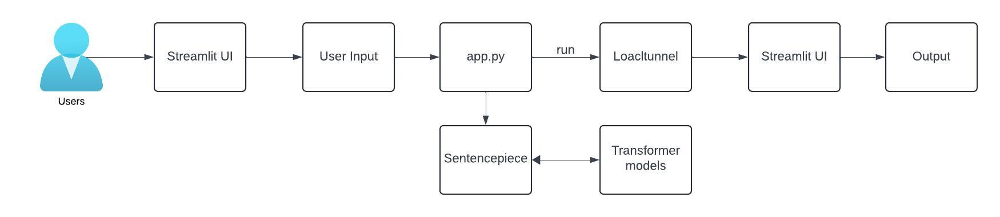

# GenerativeAI Project
AI LinguaLink - Building a Multilingual Text Translation Tool
An app for translating text from English language to Hindi, French, German, and Spanish languages.

# Requirements
* Streamlit
* Google Colab
* AI models for translation

* # Architecture
* 

# Features
* Translation: Input English text and get instant translations into Hindi, French, German, and Spanish.
* Interactive Interface: A user-friendly web interface powered by Streamlit.
* Real-time: Translate text instantly as the user types or submits input.
* Tokenization: Use SentencePiece for handling tokenization and detokenization of text.
* Local Hosting: Share the application with others via LocalTunnel for testing and demonstration purposes.

# Authors
* @[amitdoddamani123](https://github.com/amitdoddamani123) @[ArigelaRajesh](https://github.com/ArigelaRajesh) @[rehanmohammed](https://github.com/rehanmohammed)

# References:
1) https://colab.research.google.com/drive/1BcMwDr6QpyLypoxcG994yaTwNdNdGN8W?usp=sharing
2) https://discuss.streamlit.io/t/how-to-launch-streamlit-app-from-google-colab-notebook/42399/2
3) https://share.streamlit.io/
